# Citibike data insights powered by Tableau and Python
Dashboarding repository for citibike analysis in the metropolitan New York City area for the last years.

## Authors
Daniel Cespedes - [LinkedIn](https://www.linkedin.com/in/selinzorob/) - [GitHub](https://github.com/danielczz)

## Project Outline

This project is the perfect enabler for **overseeing the largest bike sharing program in the United States**. In this repository you will find all you need to generate regular reports for city officials looking to publicize and improve the city program decision making.

Since 2013, the Citi Bike Program has implemented a robust infrastructure for collecting data on the program's utilization. That is the data that we are going to use for data analysis purposes. 

The data is provided on real time and available online.

### **Technology landscape**

1. Python, to provide data analysis: 
[_Python_](https://www.python.org/)

1. Pandas, to provide data analysis on Python: 
[_Pandas_](https://pandas.pydata.org/)

1. Tableau, can help anyone see and understand their data. Connect to almost any database, drag and drop to create visualizations, and share with a click: 
[_Tableau_](https://www.tableau.com/)

## Data Analysis Framework

### **Data gathering**

You can review the data on the following link: [City Bike NYC System Data](https://www.citibikenyc.com/system-data)

   

### **Data analysis**

Our task in this assignment is to aggregate the data found in the Citi Bike Trip History Logs to build a data dashboard, story, or report.

- [Main script in Jupyter Notebook](https://github.com/danielczz/Dashboarding-with-Tableau-and-Python/blob/master/Resources/Data%20Engineer/Main_script_Jupyter_Notebook.ipynb)

- [Main reports in Tableau Workbook](https://github.com/danielczz/Dashboarding-with-Tableau-and-Python/blob/master/Resources/Dashboard/CityBike_analysis_powered_by_Tableau.twb)

- [Main screencaptures from Tableau](https://github.com/danielczz/Dashboarding-with-Tableau-and-Python/tree/master/Resources/Images/Output)

### **Data sharing**

### Screencaptures of the final Tableau Dashboard:
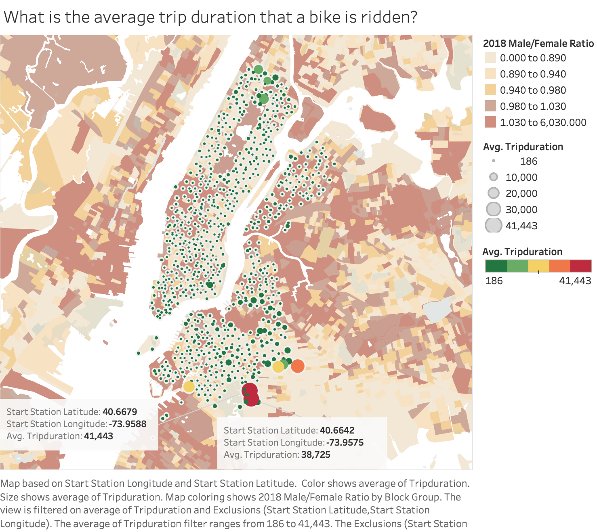
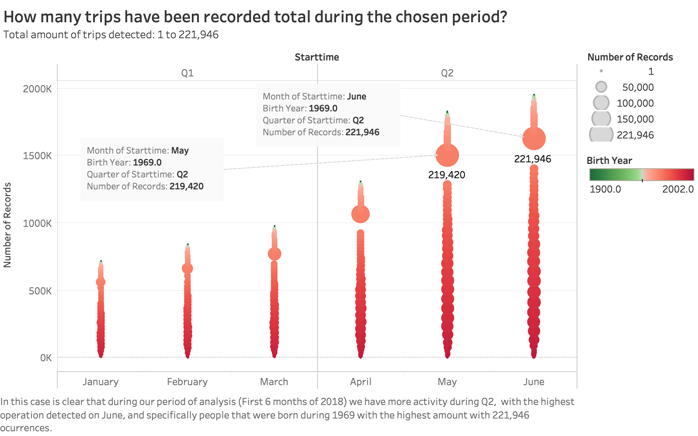
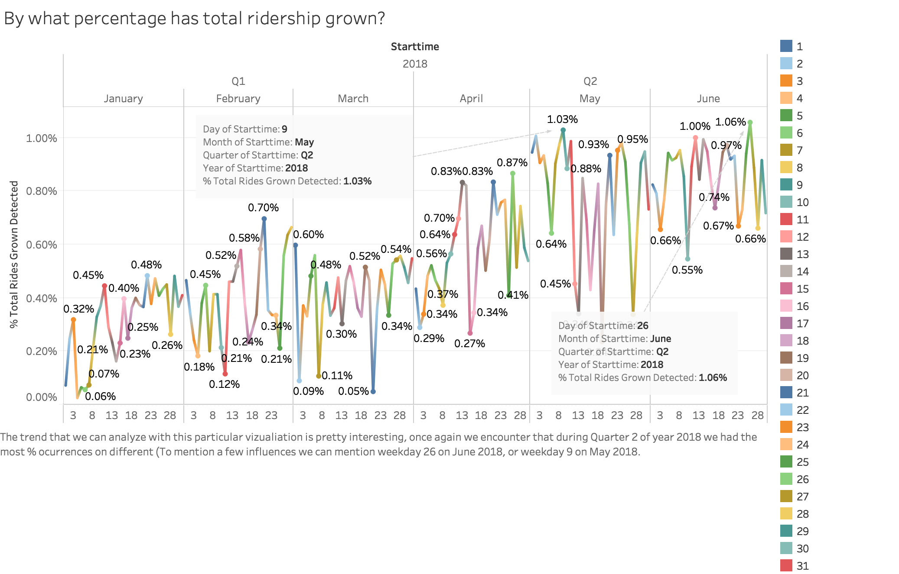
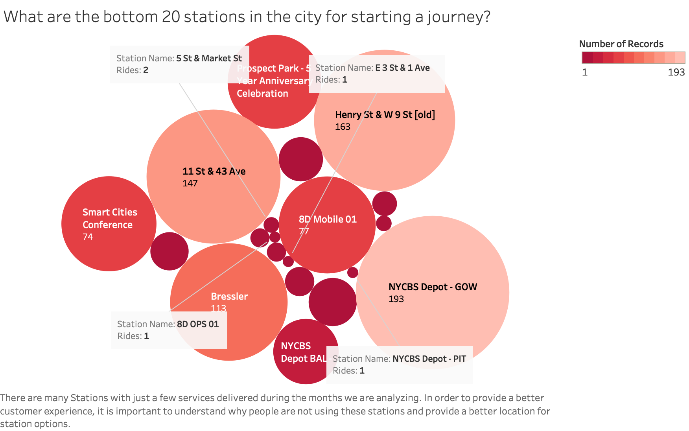
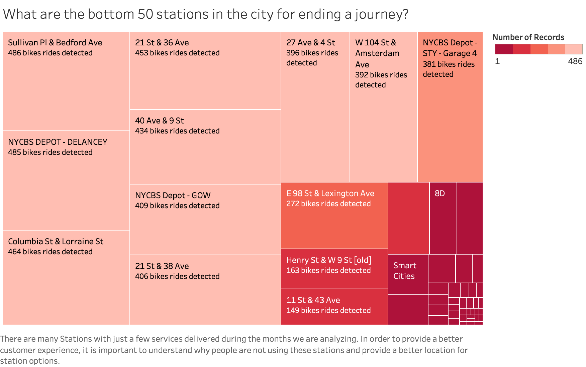
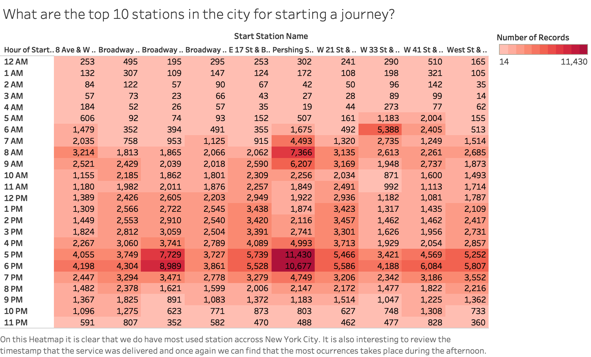
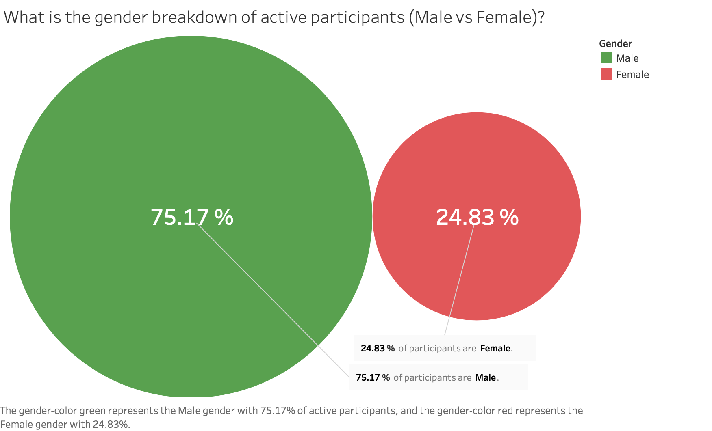
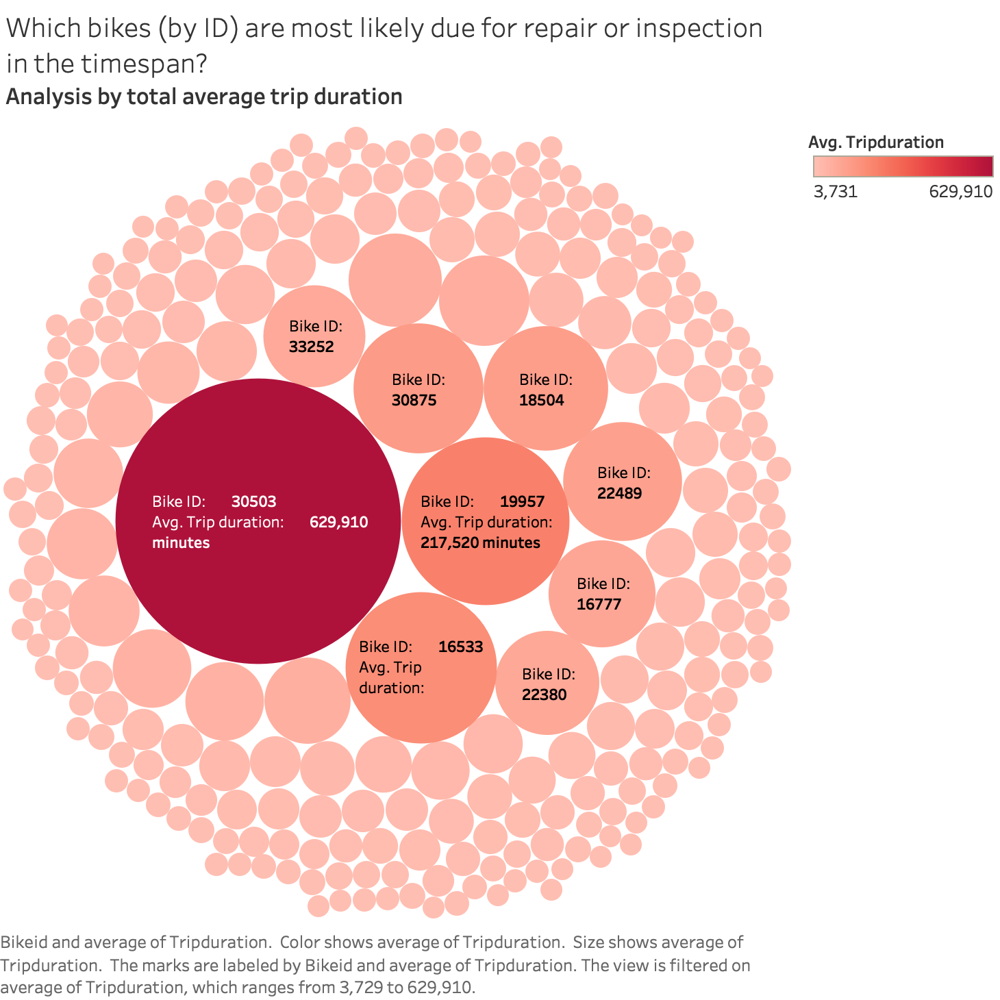
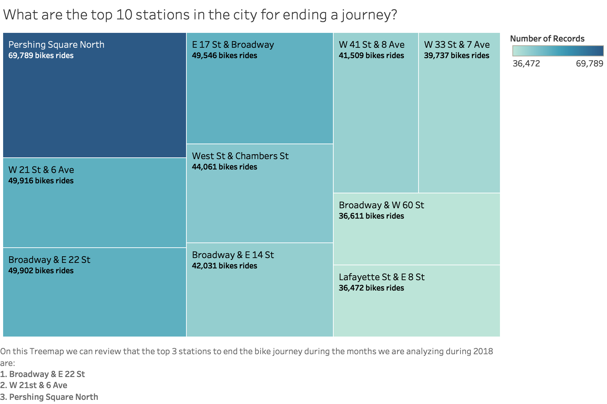
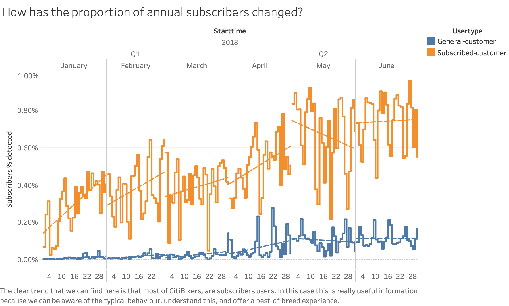
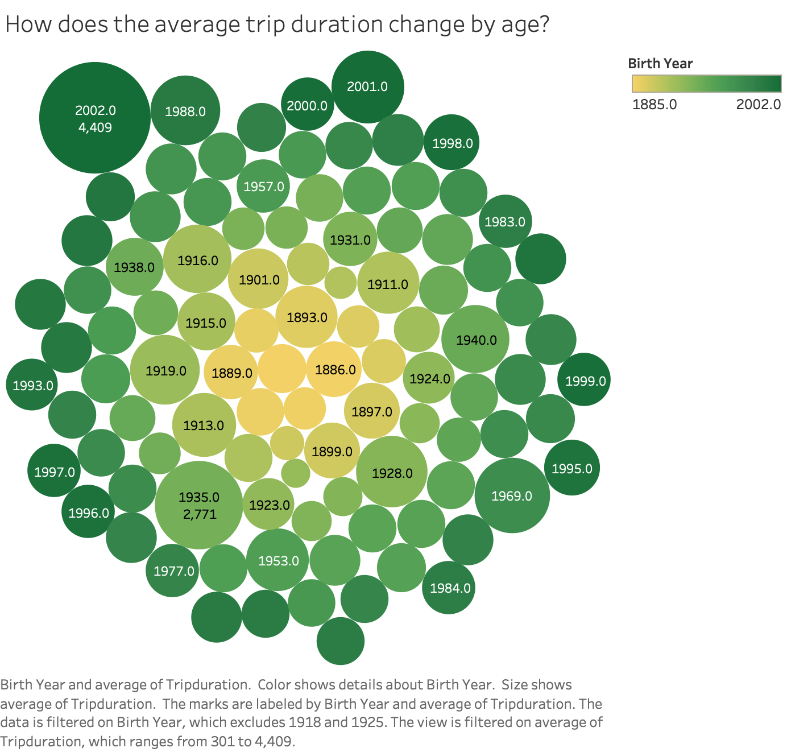
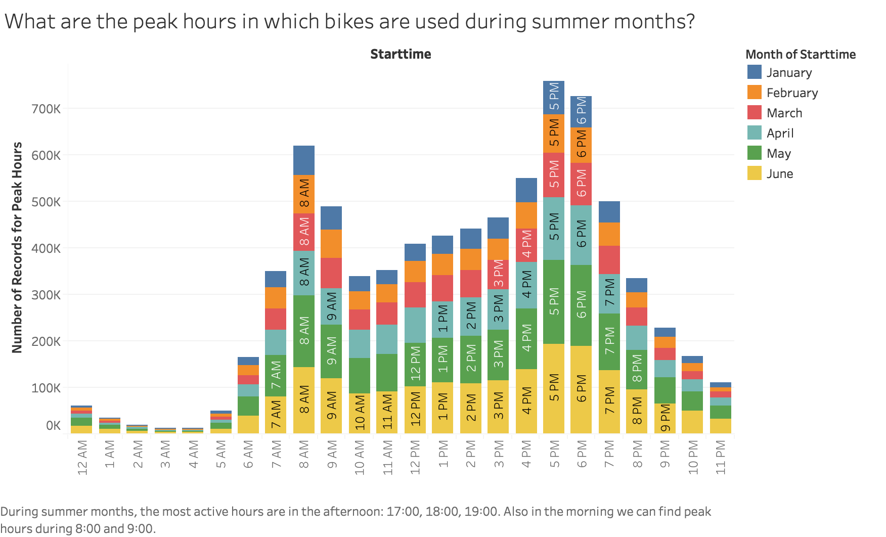
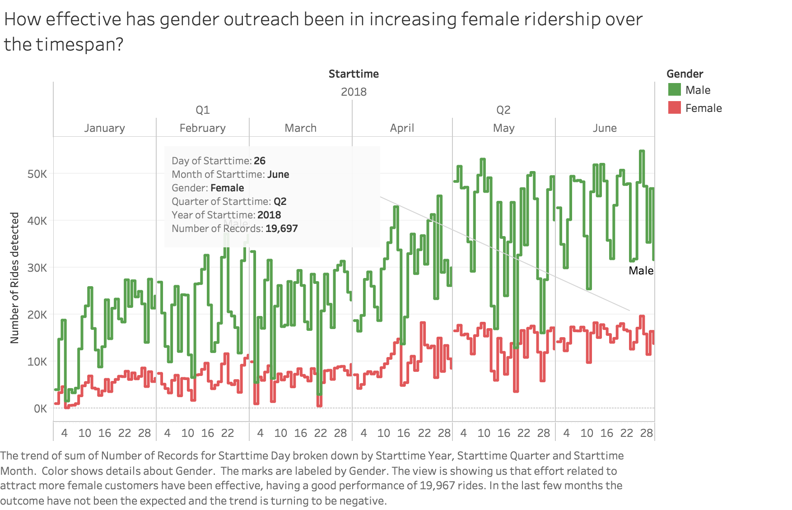